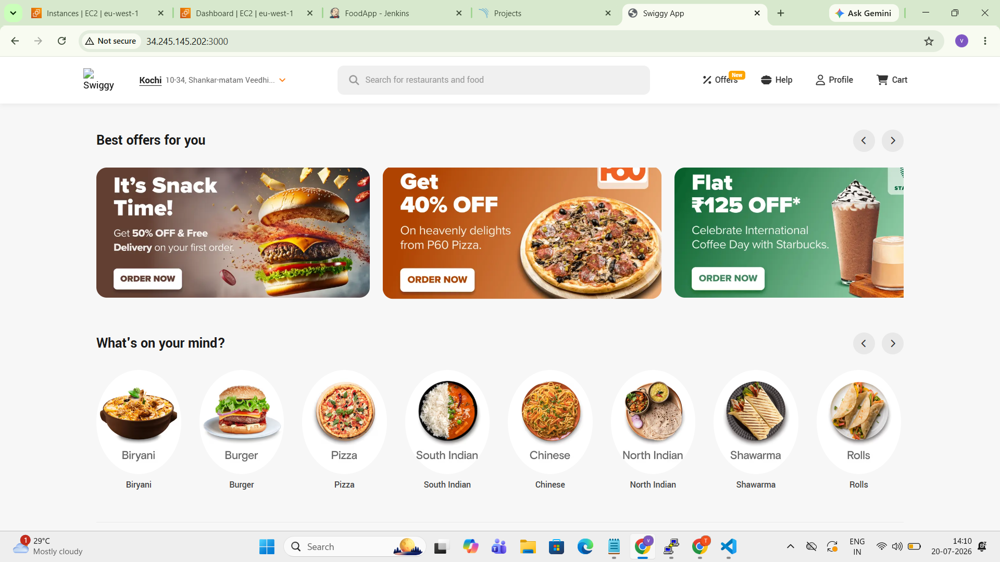
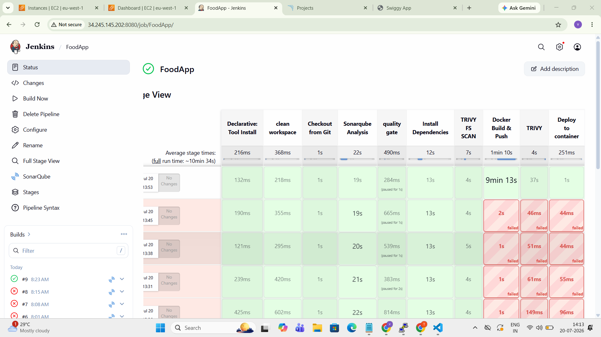

# 🚀 **DevOps Real-time Project: FoodApp Deployment**

In this **real-time DevOps project**, I demonstrate how to **deploy a Food Application (Swiggy Clone)** using various modern tools and services in the DevOps ecosystem.

---

## 📸 Screenshots



> *Add more screenshots to the `Photos/` directory and reference them here.*

---

## 🛠️ Tools & Services Used

| Tool | Badge |
|------|-------|
| **Terraform** |  |
| **GitHub** |  |
| **Jenkins** |  |
| **SonarQube** |  |
| **OWASP** |  |
| **Trivy** |  |
| **Docker & DockerHub** |  |
| **ArgoCD** |  |

---

## 📋 Project Overview

This project provisions an **AWS EC2 instance** using **Terraform**, sets up **Jenkins** and **SonarQube** on it, and builds a CI/CD pipeline that:

1. Checks out the code from **GitHub**
2. Runs **SonarQube** code analysis
3. Performs **Trivy** filesystem and image vulnerability scans
4. Builds a **Docker** image and pushes it to **DockerHub**
5. Deploys the container on the EC2 instance
6. Optionally deploys to **Kubernetes** via **ArgoCD**

---

### Tech Stack (Frontend)
- React 18
- Bootstrap 5.3 (minimal, custom CSS)
- Font Awesome icons
- Google Fonts (Yantramanav, Lexend)

---

## 🏗️ Infrastructure as Code (Terraform)

The **Terraform** configuration provisions a complete AWS environment:

### Files
| File | Purpose |
|------|---------|
| `Terraform/terraform.tf` | Provider config (AWS 6.44.0) |
| `Terraform/provider.tf` | AWS region (eu-west-1) |
| `Terraform/variables.tf` | AMI ID variable |
| `Terraform/main.tf` | Main resources (VPC, SG, EC2) |
| `Terraform/user_data.sh` | Bootstrap script |
| Create a folder named 'keys' and store VM keys

### Resources Created
- **EC2 Key Pair** (`ec2_key_pair`) for SSH access
- **Default VPC** (`aws_default_vpc`)
- **Security Group** (`default_sg`) with ingress rules:
  - SSH (port 22)
  - HTTP (port 80)
  - HTTPS (port 443)
  - Jenkins (port 8080)
  - SonarQube (port 9000)
- **EC2 Instance** (`foodapp-instance`) - t2.medium, 30GB gp3 SSD

### User Data (Bootstrap)
The `user_data.sh` script automatically installs:
- **Java 21** (required for Jenkins)
- **Jenkins** (LTS via official repos)
- **Docker** (with ubuntu user in docker group)
- **SonarQube** (Docker container on port 9000)
- **Trivy** (vulnerability scanner)

### Deploy Terraform
```bash
cd Terraform
terraform init
terraform plan
terraform apply -auto-approve
```

---

## 🔧 Jenkins Pipeline Configuration

### Jenkins Tools Setup
In **Jenkins Dashboard → Manage Jenkins → Tools**, configure:

| Tool | Name | Version |
|------|------|---------|
| **JDK** | `jdk21` | JDK 21 (install automatically) |
| **NodeJS** | `node26` | NodeJS 26 (install automatically) |
| **SonarQube Scanner** | `sonar-scanner` | Latest |
| **docker** | `docker` | Latest |

### Jenkins Plugins Required
- Pipeline
- Git
- SonarQube Scanner
- Quality Gates
- Docker Pipeline
- OWASP Dependency Check
- Blue Ocean (optional, for better UI)

### Credentials to Add
In **Jenkins Dashboard → Manage Jenkins → Credentials**:

| ID | Type | Purpose |
|----|------|---------|
| `Sonar-token` | Secret text | SonarQube authentication token |
| `docker-creds` | Username with PAT | DockerHub login |

## 📊 SonarQube Configuration

### Step-by-Step SonarQube Setup

1. **Access SonarQube**: `http://<EC2-PUBLIC-IP>:9000`
2. **Default login**: `admin` / `admin`
3. **Change password** when prompted
4. **Create a project**:
   - Project key: `foodApp`
   - Project name: `foodApp`
5. **Generate a token**:
   - Go to **My Account → Security**
   - Generate token (e.g., `squ_...`)
   - Copy the token –> add it to Jenkins as credential `Sonar-token`
6. **Configure Webhook** (for Quality Gate):
   - Go to **Administration → Configuration → Webhooks**
   - Create a webhook pointing to: `http://<JENKINS-PUBLIC-IP>:8080/sonarqube-webhook/`
7. **Install SonarQube Scanner plugin** in Jenkins
8. **In jenkins --> System --> configure sonar server
---

### Pipeline Stages
The `jenkinsfile` defines the following pipeline:

```
1. Clean Workspace
2. Checkout from Git (main branch)
3. SonarQube Analysis
4. Quality Gate check
5. Install Dependencies (npm install)
6. Trivy FS Scan
7. Docker Build & Push
8. Trivy Image Scan
9. Deploy to Container (docker run)
```


---


## ✅ Key Features

- **Immutable Infrastructure** with Terraform
- **Automated CI/CD** with Jenkins Pipeline
- **Code Quality** checks with SonarQube
- **Vulnerability Scanning** with Trivy
- **Containerized Deployment** with Docker
- **GitOps ready** with ArgoCD manifests
- **Responsive UI** with modern React components
- **Security-hardened** security group rules

---

## 📝 License

This project is for educational/demonstration purposes.
